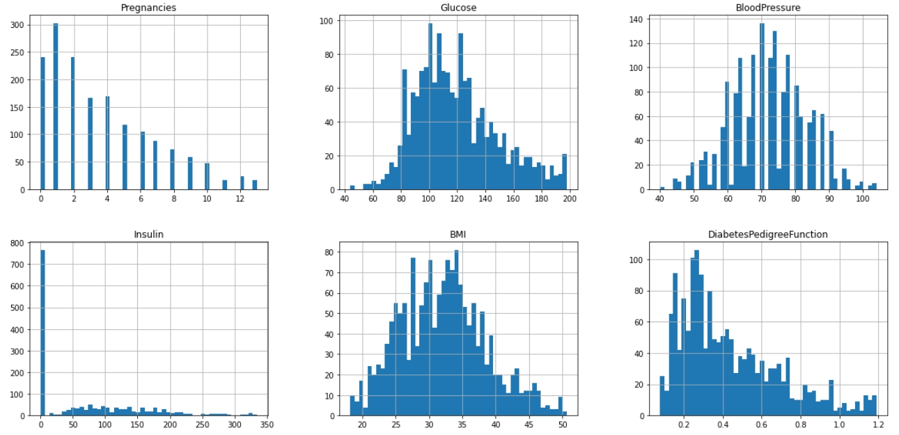
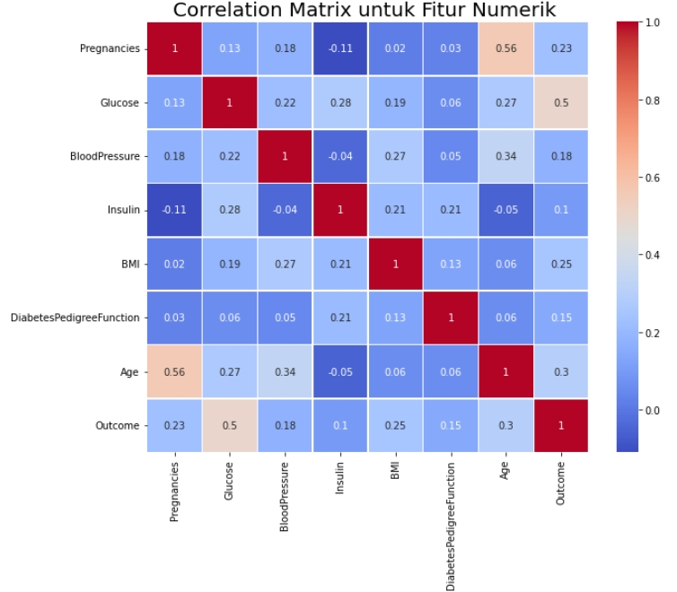

# Laporan Proyek Machine Learning - Rifqi Arrahim
 
## Domain Proyek
Saya memilih domain kesehatan, karena saat ini kita sedang menghadapi pandemic Covid-19.
Covid-19 dapat menular dengan cepat dan menyerang orang-orang yang kita sayangi. 
Orang yang mempunyai penyakit-penyakit komorbid mendapat efek lebih parah ketika terkena Covid-19.
Salah satu penyakit komorbid adalah diabetes.  Banyak orang yang masih belum mengetahui dirinya mengidap diabetes.
Oleh karena itu saya mengembangkan proyek ini agar orang-orang bisa mengetahui apakah dirinya mengidap diabetes atau tidak. 
referensi : 
[Diabetes, Other Risk Factors, and 12-Yr Cardiovascular Mortality for Men Screened in the Multiple Risk Factor Intervention Trial
Jeremiah Stamler, MD, Olga Vaccaro, MD, James D Neaton, PHD, Deborah Wentworth, MPH and The Multiple Risk Factor Intervention Trial Research Group](https://care.diabetesjournals.org/content/16/2/434.short) 
[Diabetes is a risk factor for the progression and prognosis of COVID-19
Weina Guo,Mingyue Li,Yalan Dong,Haifeng Zhou,Zili Zhang,Chunxia Tian,Renjie Qin,Haijun Wang,Yin Shen,Keye Du,Lei Zhao,Heng Fan,Shanshan Luo,Desheng Hu](https://onlinelibrary.wiley.com/doi/full/10.1002/dmrr.3319)
 
## Business Understanding
Diabetes memiliki beberapa ciri/faktor seperti kadar glukosa, insulin, tekanan darah dll.
Saya akan membantu dokter mengidentifikasi orang-orang yang mengidap diabetes.
Setelah pasien menginputkan data, maka program akan memberikan keluaran, apakah pasien mengidap diabetes atau tidak.
 
### Problem Statements
- Dari sekian faktor yang ada, faktor apakah yang paling berpengaruh terhadap penyakit diabetes
- Apakah pasien mengidap diabetes atau tidak
 
### Goals
- Mengetahui faktor apa yang paling berpengaruh terhadap penyakit diabetes
- Membuat model machine learning yang dapat memprediksi apakah pasien mengidap diabetes seakurat mungkin berdasarkan faktor-faktor yang ada.
 
### Solution Statements
Untuk menyelesaikan permasalahan ini saya akan menggunakan 3 algoritma machine learning, yaitu knn, SVM , dan decision tree. 
- KNN adalah algoritma yang relatif sederhana dibandingkan dengan algoritma lain. Algoritma KNN menggunakan ‘kesamaan fitur’ untuk memprediksi nilai dari setiap data yang baru.
Dengan kata lain, setiap data baru diberi nilai berdasarkan seberapa mirip titik tersebut dalam set pelatihan. KNN bekerja dengan membandingkan jarak satu sampel ke sampel pelatihan lain dengan memilih sejumlah k-tetangga terdekat.
Meskipun algoritma KNN mudah dipahami dan digunakan, ia memiliki kekurangan jika dihadapkan pada jumlah fitur atau dimensi yang besar. Permasalahan ini sering disebut sebagai curse of dimensionality (kutukan dimensi). 
Pada dasarnya, permasalahan ini muncul ketika jumlah sampel meningkat secara eksponensial seiring dengan jumlah dimensi (fitur) pada data.
- Support Vector Machine adalah model ML multifungsi yang dapat digunakan untuk menyelesaikan permasalahan klasifikasi, regresi, dan pendeteksian outlier.
Termasuk ke dalam kategori supervised learning, SVM adalah salah satu metode yang paling populer dalam machine learning.
Tujuan dari algoritma SVM adalah untuk menemukan hyperplane terbaik dalam ruang berdimensi-N (ruang dengan N-jumlah fitur) yang berfungsi sebagai pemisah yang jelas bagi titik-titik data input.
- Decision Tree merupakan salah satu algoritma yang sangat mudah dipahami dalam klasifikasi objek. Algoritma ini adalah salah satu algoritma Supervised Learning.
Decision Tree membagi data menjadi himpunan bagian berdasarkan variabel inputnya. Algoritma ini merupakan jenis diagram alir yang membantu dalam proses pengambilan keputusan.
Decision Tree ini menjadi alat pendukung keputusan yang menggunakan grafik atau model seperti pohon.
 
## Data Understanding
[Dataset](https://www.kaggle.com/mathchi/diabetes-data-set) berjumlah 2000 record ini berasal dari National Institute of Diabetes and Digestive and Kidney Diseases. Tujuannya adalah untuk memprediksi berdasarkan pengukuran diagnostik apakah pasien menderita diabetes.
Secara khusus, semua pasien di sini adalah perempuan berusia minimal 21 tahun dari keturunan Pima India.
 
Pregnancies: Berapa kali hamil 
Glucose: Konsentrasi glukosa plasma 2 jam dalam tes toleransi glukosa oral 
Blood Pressure: Tekanan darah diastolik (mm Hg) 
Skin Thickness: Ketebalan lipatan kulit trisep (mm) 
Insulin: insulin serum 2 Jam (mu U/ml) 
BMI: Indeks massa tubuh (berat dalam kg/(tinggi dalam m)^2) 
Diabetes Pedigree Function: Fungsi silsilah diabetes 
Age: Usia (tahun) 
Outcome: Variabel kelas (0 atau 1) 
Sumber: 
(a) Pemilik asli: Institut Nasional Diabetes dan Pencernaan dan Penyakit Ginjal 
(b) Donatur database: Vincent Sigillito (vgs@aplcen.apl.jhu.edu)
Pusat Penelitian, Pemimpin Grup RMI
Laboratorium Fisika Terapan
Universitas Johns Hopkins
Jalan John Hopkins
Laurel, MD 20707
(301) 953-6231 
(c) Tanggal diterima: 9 Mei 1990 

Pertama, saya menghapus kolom skinthickness karena data tersebut tidak lengkap, dalam kagle dijelaskan tidak semua rentang umur mempunyai data skinthickness 

 
Skewness adalah kondisi di mana dataset cenderung memiliki distribusi data yang tidak seimbang. Skewness akan mempengaruhi data dengan menciptakan bias terhadap model. Dari visualisasi diatas dapat disimpulkan kolom insulin dan DiabetesPedigreeFunction memiliki distribusi yang tidak seimbang. Oleh karena itu saya melakukan Reciprocal Transformation 
Setelah itu saya mengecek korelasi antara outcome dengan fitur-fitur yang lain.
 
Jika nilai korelasi semakin mendekati 1 maka korelasi antara dua fitur tersebut makin kuat. Dapat dilihat pada bagian bawah  Glucose memiliki korelasi paling kuat dengan outcome dibandingkan dengan fitur yang lainnya yaitu bernilai 0.5. Sedangkan kolom Insulin memiliki nilai yang paling mendekati 0. Oleh karena itu saya menghapus kolom insulin  

 
 
## Data preparation
### Data Cleaning
#### Basics
Saya menghapus kolom skinthickness karena data tersebut tidak lengkap, dalam kagle dijelaskan tidak semua rentang umur mempunyai data skinthickness.
#### Missing Value
Saya mengecek nilai 0 pada kolom glucose, BloodPressure, BMI, DiabetesPedigreeFunction dan Age karena data tersebut tidak mungkin bernilai 0.
Ketika ada data di kolom tersebut yang bernilai 0, Saya akan menghapus record tersebut. 
#### Outliers
Saya menggunakan boxplot terhadap semua fitur untuk melihat penyebaran data dan outliers. Lalu menggunakan metode interquartile untuk mengecek outliers.Jika terdapat outliers/pencilan maka hapus data tersebut.
### Feature Engineering
Feature Engineering merupakan proses membuat variabel input baru dari variabel data yang sudah ada. Berdasarkan hasil data Understanding kolom Insulin dan DiabetesPedigreeFunction memiliki sebaran data yang buruk. Sehingga saya melakukan Square Root Transformation pada kolom tersebut. Square Root Transformation mengubah nilai dengan mengakarkan nilai tersebut.
### Feature Selection
Feature Selection digunakan untuk mencari fitur yang relevan dengant outcome. Dari hasil data understanding dapat disimpulkan fitur Insulin kurang relevan digunakan karena memiliki nilai korelasi 0.05 atau mendekati 0.
### Data Transforms
#### Train Test Split
Dalam tahap ini saya membagi dataset menjadi data latih sebanyak 90% dan data uji sebanyak 10%.
#### Standardization
Saya melakukan standarisasi agar algoritma machine learning memiliki performa lebih baik dan konvergen lebih cepat ketika dimodelkan pada data dengan skala relatif sama atau mendekati distribusi normal. Proses standarisasi membantu untuk membuat fitur data menjadi bentuk yang lebih mudah diolah oleh algoritma.
 
## Modelling
Tahap ini saya mengembangkan model machine learning dengan tiga algoritma yaitu KNN, Decision Tree, dan SVM. Model dibangung dengan bantuan library skicit learn. Setelah memanggil library penulis melakukan hyperparameter tuning dengan bantuan gridsearchcv.  
### SVM
Model ini membuat sebuah Hyperplane di antara data dengan margin yang maksimal. Hyperplane adalah sebuah garis yang memisahkan data positif diabetes dan negatif diabetes. Margin adalah jarak Hyperplane dengan data tersebut. Semakin besar margin yang dibuat, semakin tinggi akurasi yang kita dapatkan.
- C : 1.0 
Fungsi Parameter : Seberapa besar kita ingin menghindari kesalahan klasifikasi setiap training. Saya menggunakan nilai default yaitu 1.0.
- degree : 3 
Fungsi Parameter : Derajat fungsi kernel. Saya menggunakan nilai default yaitu 3.
- gamma : scale 
Fungsi Parameter : Seberapa jauh pengaruh setiap satu training. Saya menggunakan nilai default yaitu 'scale'.
### KNN
Pertama model akan menentukan nilai k. Nilai k adalah jumlah n_neighbors atau data terdekat yang akan dijadikan acuan. Lalu model akan menghitung jarak tersebut dan melakukan klasifikasi.
- leaf_size : 30 
Fungsi Parameter : leaf_size dapat mempengaruhi kecepatan dan memori yang diperlukan untuk menyimpan pohon.
- n_neighbors : 10 
Fungsi Parameter : n_neighbors untuk mengatur nilai k pada KNN.
- weights : distance 
Fungsi Parameter : Semakin dekat data maka akan semakin besar pengaruh yang diberikan.
- metric : euclidian 
Fungsi Parameter : Fungsi untuk menghitung jarak
### Decision Tree
Model akan membuat sebuah root nodes, lalu akan membuat percabangan dengan memilih fitur-fitur yang ada dengan menghitung entropy dan information gain. Ketika tree sudah mencapai leaf nodes atau tidak mempunyai cabang lagi, maka nodes tersebut merupakan output dari model
- criterion : gini 
Fungsi Parameter : Fungsi untuk mengukur kualitas percabangan.
- max_depth : 3 
Fungsi Parameter : Maksimum level pohon.
- max_features : None 
Fungsi Parameter : Menentukan jumlah fitur ketika bercabang.
- min_samples_leaf : 5 
Fungsi Parameter : Minimum jumlah sampel yang dibutuhkan untuk leaf node.
- min_samples_split : 2 
Fungsi Parameter : Minimum jumlah sampel untuk internal node bercabang.
 
## Evaluation
Fitur glucose memiliki nilai korelasi yang besar dengan label outcome berdasarkan hal itu dapat disimpulkan bahwa kadar glukosa dalam tubuh merupakan faktor yang paling berpengaruh untuk mengidentifikasi apakah pasien mengidap diabetes atau tidak. 
Dari ketiga model di atas saya menggunakan metrics.classisfication_report yang merupakan library bawaan dari skicitlearn untuk mengevaluasi model. Output dari model dapat diklasifikasikan menjadi empat. 
1. True Positive atau TP. Ketika model memberikan output positif diabetes dan label data test bernilai positif diabetes.
2. True Negative atau TN. Ketika model memberikan output negatif diabetes dan label data test bernilai negatif diabetes.
3. False Positive atau FP. Ketika model memberikan output positif diabetes sedangkan label data test bernilai negatif diabetes.
4. False Negative atau FN. Ketika model memberikan output negatif diabetes sedangkan label data test bernilai positive diabetes.
$$Precision = \frac{TP}{TP + FP} $$ 
$$Recall = \frac{TP}{TP + FN} $$ 
$$F1 = \frac{2 * Precision*Recall}{Precision+Recall}$$ 
### SVM
.jpg)
### KNN
.jpg)
### Decision Tree
.jpg) 
Nilai precision, recall, dan f1-score sering digunakan untuk mengevaluasi masalah klasifikasi. Dari nilai f1-score model KNN dan Decision Tree memiliki nilai lebih baik dibandingkan model SVM. Jadi dapat disimpulkan model KNN dan Decision Tree dapat memberikan output yang lebih tepat dibandingkan model SVM. 
 
